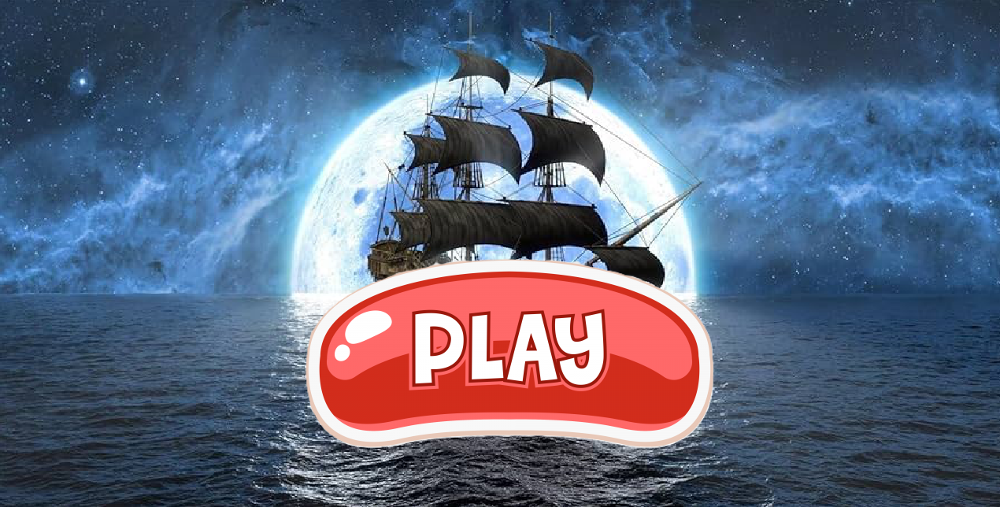

# Project Title: challenge-whoo

## Description

Challenge-Whoo is a game that is structured with the player starting the game by clicking the start button and the question, player icons and the textbox all show up in that one frame. The player enters the their answer in the textbox and the progame decides whether or not the answer is correct which could affect the ranking of the player. Once the first player to lose get down to the edge of the screen the shark will jump signifying that the game has ended. This game was created using an appplication called  pygame and is meant for all ages to mentally challenge players by using timeline quetsions to push them into expanding their critical thinking abilities.

Installation: Download repository and then run the code using the button at the top right corner.

Usage: When entering a guess click on the red box to activate it and only type numbers as answers.

License: MIT

AI Documentation: AI was used to generate a bit of code for functions, debug and general overall code and generate pictures for the players. With this assistance I learnt how to do specific functions that i was new to in order to impove the project.